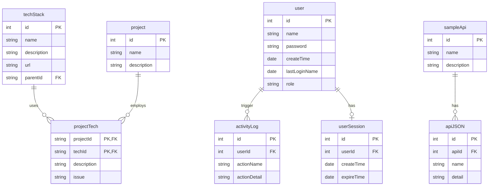

```mermaid
erDiagram
    techStack ||--o{ projectTech : "uses"
    project ||--o{ projectTech : "employs"
    user ||--o{ activityLog: "trigger"
    user ||--o| userSession: "has"
    sampleApi ||--o{ apiJSON: "has"

    techStack {
        int id PK
        string name
        string description
        string url
        string parentId FK
    }

    project {
        int id PK
        string name
        string description
    }

    projectTech {
        string projectId PK,FK
        string techId PK,FK
        string description
        string issue
    }
    
    user {
	    int id PK
	    string name
	    string password
	    date createTime
	    date lastLoginName 
	    string role
    }

	userSession {
		int id PK
		int userId FK 
		date createTime
		date expireTime
	}

	activityLog {
		int id PK 
		int userId FK
		string actionName
		string actionDetail
	}

	sampleApi {
		int id PK 
		string name 
		string description 
	}

	apiJSON {
		int id PK
		int apiId FK
		string name 
		string detail
	}
	

	
```

