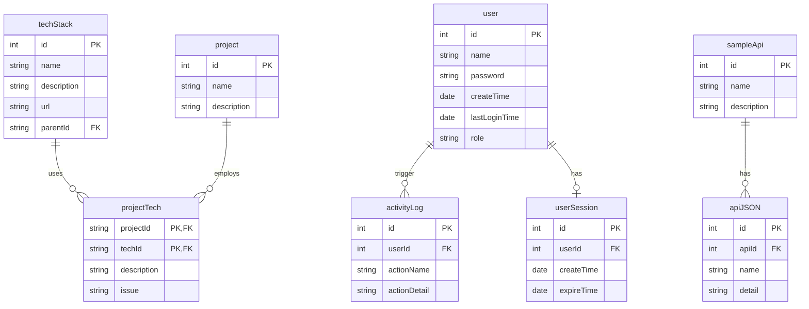
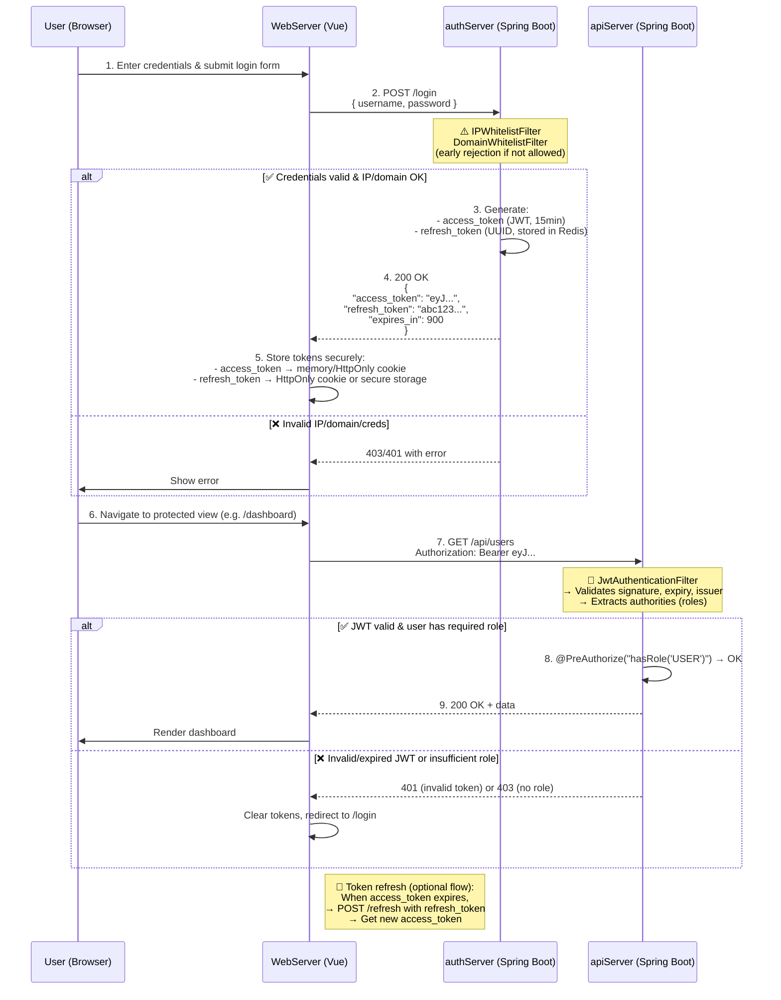

### DB Schema for ApiServer

### Sequence diagram for  Single Sign On with JWT 

Here's a **Mermaid sequence diagram** illustrating the **login flow** across your three systems:

- `WebServer` (Vue frontend)
- `authServer` (Spring Boot authentication server — issues JWT + refresh tokens)
- `apiServer` (Spring backend — protected resources, validates JWT)

The flow includes: 
✅ Credentials submission  
✅ IP/domain whitelist checks (early in `authServer`)  
✅ JWT issuance (short-lived access + long-lived refresh)  
✅ Subsequent API call with access token  
✅ RBAC enforcement on `apiServer`

